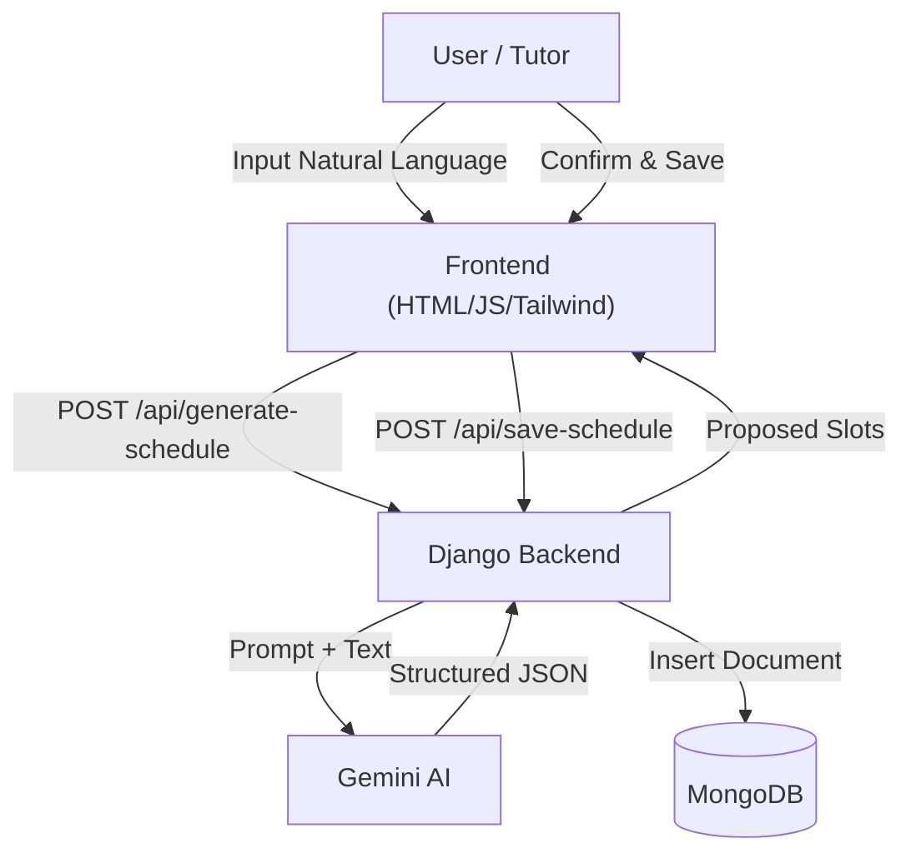

# Calendar Copilot

Calendar Copilot is an AI-powered appointment scheduling assistant designed to streamline the process of setting up weekly availability. Instead of manually clicking through time slots on a calendar grid, users (tutors, consultants, etc.) can simply describe their availability in natural language. The system uses Generative AI to parse this input, visualize the proposed schedule, and save it to a database.

## Key Features

*   **Natural Language Input:** Describe your availability effortlessly (e.g., "I'm free weekends from noon to 4pm").
*   **AI Parsing:** powered by Google's Gemini 3 Flash to intelligently extract days and times from text.
*   **Visual Confirmation:** Presents a clean, card-based weekly view of the parsed slots for verification.
*   **Persistent Storage:** Saves confirmed profiles and schedules to a MongoDB database.
*   **Responsive UI:** A modern, user-friendly interface built with Tailwind CSS.

## System Architecture

The system follows a modern web application architecture integrating a Django backend with a Generative AI service and NoSQL storage.



## Project Structure

```
calendar_copilot/
├── calendar_copilot/       # Main Django project configuration
│   ├── settings.py         # App settings (Env vars, Installed Apps)
│   ├── urls.py             # Root URL routing
│   └── wsgi.py
├── scheduler/              # Main application app
│   ├── services/           # Business logic & External integrations
│   │   └── ai_service.py   # Gemini AI interaction logic
│   ├── templates/          # HTML templates
│   │   └── index.html      # Single Page Application (SPA) UI
│   ├── utils/              # Helper utilities
│   │   └── mongo.py        # MongoDB connection handler
│   ├── urls.py             # App-specific URL routing
│   ├── views.py            # API View Controllers
│   └── models.py           # (Unused - utilizing MongoDB directly)
├── venv/                   # Virtual Environment (excluded from git)
├── .env                    # Environment variables (API Keys, Secrets)
├── .gitignore              # Git ignore rules
└── manage.py               # Django management script
```

## Tech Stack

*   **Backend:** Python 3.12, Django 6.0, Django Rest Framework (DRF)
*   **Database:** MongoDB (NoSQL) using `pymongo`
*   **AI Model:** Google Gemini 3 Flash via `google-generativeai` SDK
*   **Frontend:** HTML5, Vanilla JavaScript, Tailwind CSS (via CDN)
*   **Environment Management:** `python-dotenv`

## Setup & Installation

Follow these steps to run the project locally.

### Prerequisites
*   Python 3.12+
*   MongoDB installed and running locally (or a Docker container).
*   A Google Cloud API Key for Gemini.

### 1. Clone the Repository
```bash
git clone <repository-url>
cd Qupil-Task
```

### 2. Set Up Virtual Environment
```bash
python3 -m venv venv
source venv/bin/activate  # On Windows use `venv\Scripts\activate`
```

### 3. Install Dependencies
```bash
pip install -r requirements.txt
```

### 4. Configuration
Create a `.env` file in the root directory and add your credentials:
```bash
# Django Settings
DEBUG=True
DJANGO_SECRET_KEY=your_secure_random_key_here

# Database
MONGO_URI=mongodb://127.0.0.1:27017/calendar_copilot

# AI Service
GOOGLE_API_KEY=your_gemini_api_key_here
```

### 5. Start MongoDB (if using Docker)
If you don't have MongoDB installed as a service, run:
```bash
docker run -d -p 27017:27017 --name mongodb -v ~/mongo-data:/data/db mongo:latest
```

### 6. Run the Application
```bash
python3 manage.py runserver
```

Access the application at: **`http://127.0.0.1:8000/`**

## Usage Guide
1.  Enter your **Name** in the first input box.
2.  Type your availability in the text area (e.g., *"Monday and Wednesday evenings after 6pm"*).
3.  Click **Generate Calendar**.
4.  Review the cards that appear.
5.  Click **Save** to store your profile in MongoDB.
